---
output:
  pdf_document: default
  word_document: default
  html_document: default
---
Title: IL-21 remodels STAT3 and STAT5 signalling in human CD4 and CD8 T cells revealed by high-dimensional mass cytometry

One-Sentence Summary: IL-21 programs lineage- and state-specific STAT3/STAT5 signalling in human CD4 and CD8 T cells, uncovering dual-STAT “super-responder” subsets with distinct cytokine biases.

Authors: <to be completed>

Affiliations: <to be completed>

---

## Abstract

**INTRODUCTION:** Common gamma-chain cytokines such as interleukin-2 (IL-2), IL-15, and IL-21 orchestrate T cell proliferation, survival, and differentiation, yet how these cytokines partition signalling across human T cell lineages and functional states in real time remains incompletely defined. Mass cytometry (CyTOF) provides the resolution to disentangle these processes but requires robust computational workflows for normalisation, clustering, and biological annotation.

**RATIONALE:** We sought to map the early phospho-signalling landscape elicited by T cell receptor (TCR) engagement and IL-2, IL-15, or IL-21 in human T cells, with explicit focus on (i) CD4 versus CD8 lineage context, (ii) naive versus memory/effector differentiation, and (iii) pathway-specific responses through STAT3, STAT5, TCR-proximal, metabolic, and stress modules. To this end, we developed a reproducible analysis pipeline integrating CytoNorm-based normalisation, FlowSOM clustering, multi-timepoint limma models, functional phenotype scoring, and automated lineage annotation using a curated channel-to-antigen mapping.

**RESULTS:** Technical and biological quality control (QC) demonstrated stable marker behaviour across batches and conditions, enabling pooled analysis. FlowSOM identified a robust CD4/CD8 T cell architecture with naive, intermediate, and memory/effector-like states. Global dimensionality reduction of phospho medians revealed orthogonal STAT3- and STAT5-dominated axes, along which cytokine–timepoint combinations separated. Limma-based timecourse modelling showed rapid, strong STAT5 activation under IL-2 and IL-15, especially in CD8 effector-like clusters, whereas IL-21 induced slower, more sustained STAT3 signalling preferentially in CD4 memory-like clusters. Aggregating markers into functional modules distinguished STAT3-, STAT5-, TCR-, metabolic-, and stress-dominant clusters. Automated lineage annotation mapped clusters to CD4 or CD8 lineages and differentiation states and integrated functional phenotypes and cytokine bias. This revealed IL-21-biased STAT3 and STAT5 “super-responder” clusters within both CD4 and CD8 compartments, characterised by dual high STAT3/STAT5 activation and distinct UMAP and diffusion-map trajectories.

**CONCLUSION:** IL-21 does not simply mimic IL-2 or IL-15 but instead programs lineage- and state-specific STAT3 and STAT5 responses concentrated in defined CD4 memory-like and CD8 effector-like subsets. Our framework provides a generalizable strategy to dissect cytokine signalling architectures in human T cells and nominates dual-STAT “super-responder” populations as candidate targets for therapeutic modulation.

---

## Introduction

Common gamma-chain cytokines that signal through shared receptor components, including IL-2, IL-15, and IL-21, are central regulators of T cell homeostasis, effector function, and memory formation. IL-2 and IL-15 are classically viewed as STAT5-dominant cytokines that support proliferation and survival of cytotoxic T cells and natural killer cells, whereas IL-21 is associated with STAT3-driven differentiation of T follicular helper and memory-like CD4 T cells. However, these cytokines share receptor components and downstream intermediates, and their net effects arise from context-dependent integration of TCR-derived and cytokine-specific signals across a heterogeneous T cell compartment.

Mass cytometry (CyTOF) enables simultaneous measurement of dozens of surface and intracellular markers at the single-cell level and is well suited to dissect cytokine signalling. Yet, extracting mechanistic insight from such data requires robust normalisation and batch correction, unsupervised clustering to define cellular states, and biologically meaningful annotations that map clusters onto known lineages and differentiation axes. Beyond single-marker analyses, there is a need to integrate phospho-readouts into pathway-level “signatures” and to link these to lineage and cytokine context.

Here, we use CyTOF to profile signalling in human peripheral blood T cells stimulated via a peptide–MHC-dependent TCR engagement (pTCR–cHCV) and exposed to IL-2, IL-15, or IL-21 across a dense early timecourse (0–60 minutes). We develop a computational framework combining CytoNorm-based normalisation, FlowSOM clustering, multi-timepoint limma modelling, functional module scoring, and automated lineage annotation based on a curated channel-to-antigen mapping. This pipeline allows us to define how IL-2, IL-15, and IL-21 differentially engage STAT3, STAT5, and auxiliary pathways within CD4 and CD8 subsets and to identify dual-STAT “super-responder” clusters as candidate regulatory nodes.

---

## Results

### Robust normalisation and clustering support pooled analysis of cytokine timecourses

We first assessed technical performance and data completeness using anchor-based normalisation and dedicated QC scripts. Samples were annotated in `sample_table.csv` with cytokine condition (CD3, IL-2, IL-15, IL-21), timepoint (0, 2, 5, 10, 15, 30, 60 minutes), batch, anchor status, and other experimental fields. The script `scripts/R/diagnostic_signaling_qc.R` validated this table, checked for missing or inconsistent entries, and summarised coverage of cytokine × timepoint combinations. Cytokine/time coverage heatmaps (`diagnostic_plots/cytokine_time_coverage.*`) confirmed near-complete design coverage and appropriate labelling of anchor and baseline samples (Figure 1A).

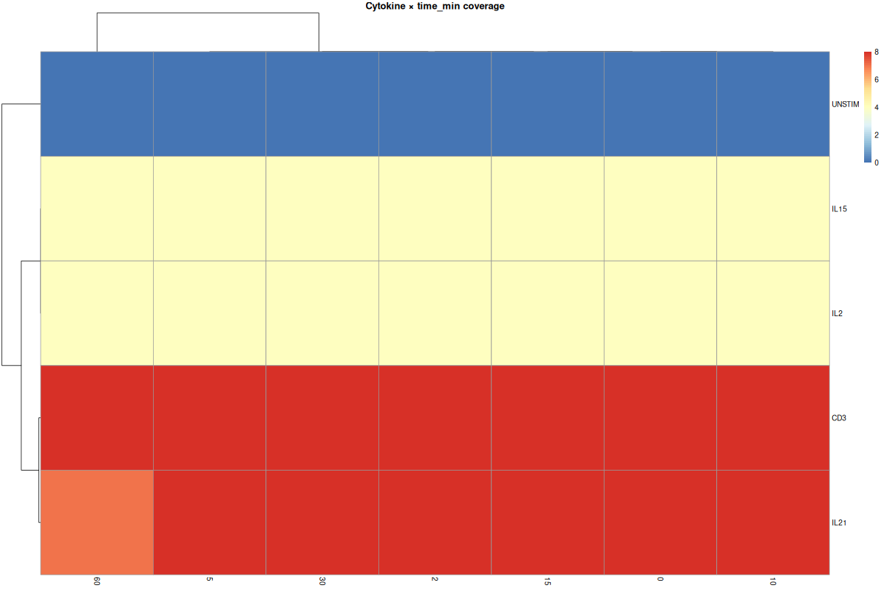{width=0.6\textwidth}

CytoNorm-based normalisation was applied using a series of scripts (`scripts/R/01_run_cytonorm.R`, `scripts/R/02_train_cytonorm.R`, `scripts/R/03_apply_cytonorm.R`, `scripts/R/03b_consolidate_normalized.R`, `scripts/R/04_qc_plots.R`, `scripts/R/05_plot_normalization_efficiency.R`, `scripts/R/05_export_summary.R`), complemented by diagnostic utilities (`scripts/R/diagnostic_signaling_qc.R`). Anchor samples spanning batches were used to train batch-specific transformations that align marker intensity distributions across batches. Post-normalisation diagnostics, including global and lineage-level normalisation plots (`summary/normalization_efficiency.pdf`, `summary/normalization_efficiency_lineage.pdf`) and density overlays for key channels (`summary/more_qc/density_overlays_top_channels.pdf`), showed minimal residual batch-specific shifts, with stable distributions for both lineage and phospho markers (Figure 1B–D).

{width=0.6\textwidth}

{width=0.6\textwidth}

We used FlowSOM to cluster arcsinh-transformed marker expression into phenotypically coherent T cell states. Clustering operated on a selected set of lineage and functional markers, and a fixed grid size and metacluster number were used, as defined in `scripts/R/02_flowsom_annotate.R`. For each metacluster, median marker expression was computed and stored in `flowsom_results/metacluster_medians_asinh.csv`. FlowSOM minimal spanning tree (MST) and heatmaps (`flowsom_results/flowsom_MST_tree.png`, `metacluster_heatmap.png`, `metacluster_lineage_heatmap.png`) showed a clear segregation of CD4- and CD8-like clusters and further structure along naive–memory and activation axes (Figure 2A–C).

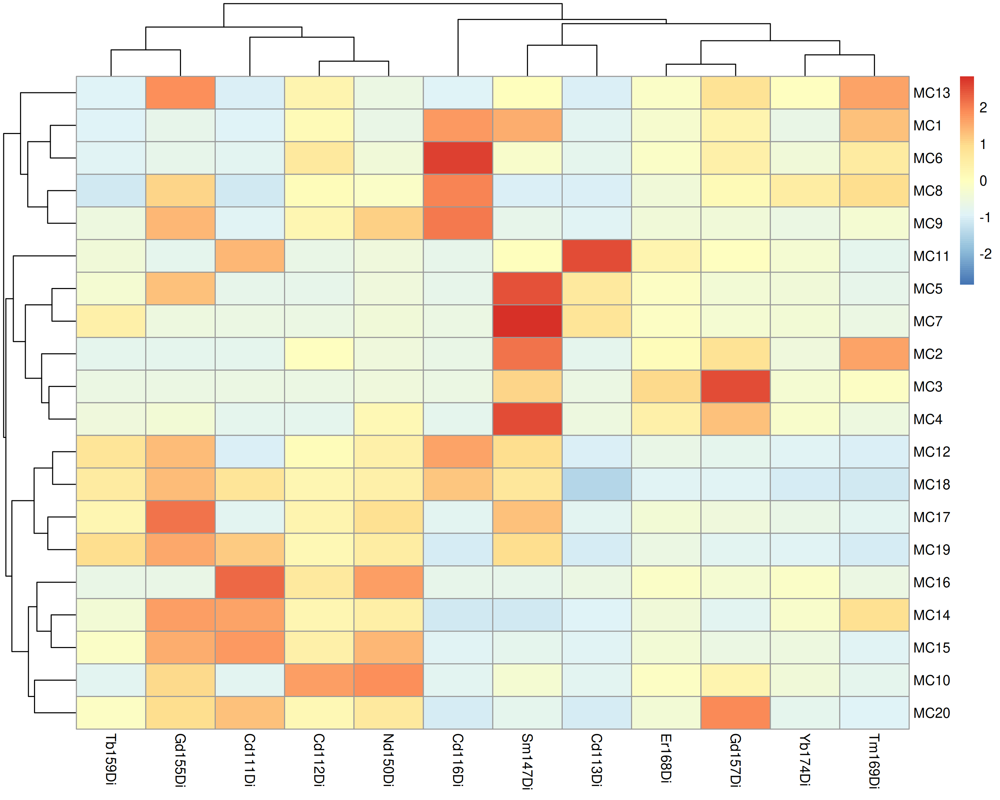{width=0.7\textwidth}

Low-dimensional embeddings of single-cell events produced by UMAP and t-SNE (`scripts/R/03_dimred_flowsom.R`, `scripts/R/04c_tsne_umap_clusters.R`) were used for QC. Embeddings coloured by FlowSOM cluster, batch, sample and timepoint (`qc_plots/umap_clusters.png`, `qc_plots/umap_by_batch.png`, `qc_plots/tsne_clusters.png`) showed no major batch-driven structure. Cluster count summaries (`diagnostic_plots/cluster_counts_per_condition.*`) ensured that no single condition dominated a given cluster, supporting downstream statistical comparisons (Figure 2D–F).

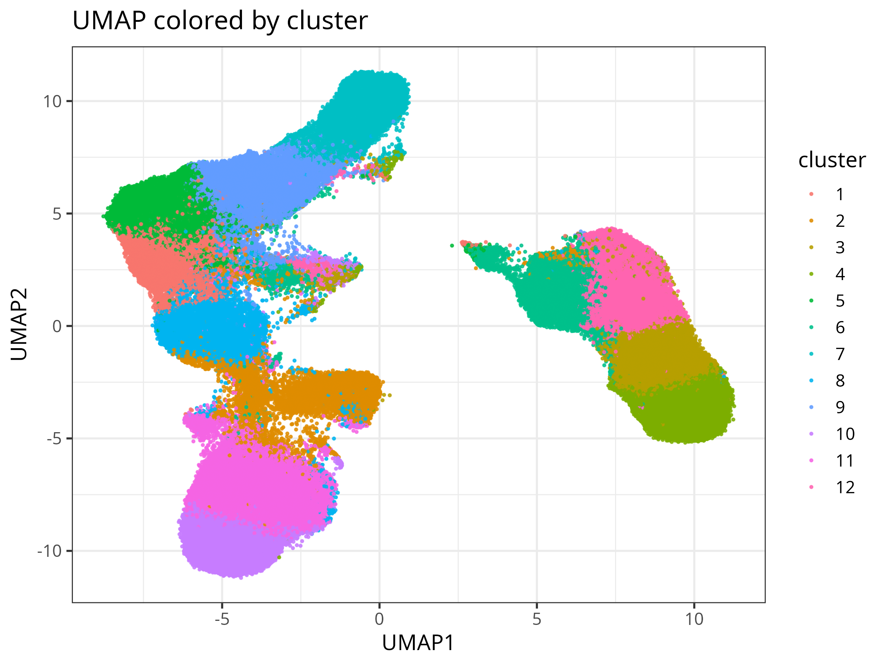{width=0.48\textwidth}
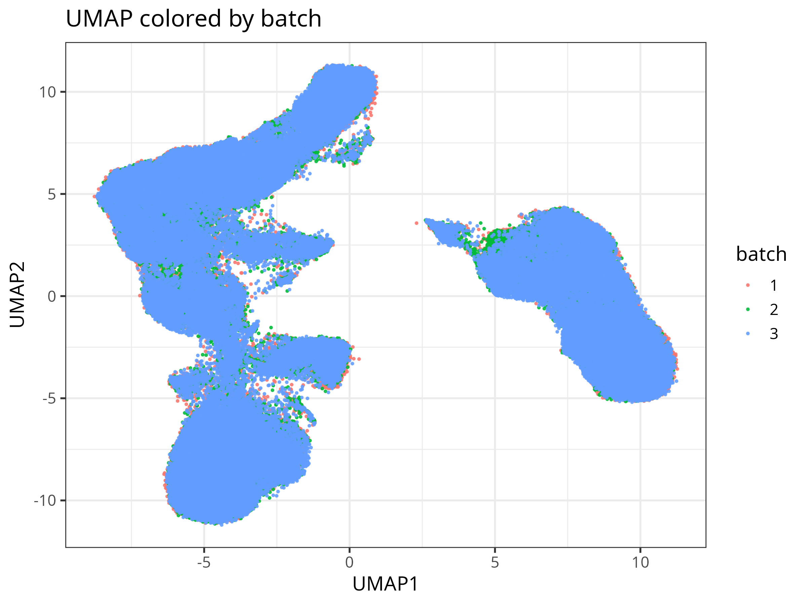{width=0.48\textwidth}

### Global phospho-signalling is structured along STAT3 and STAT5 axes

To explore global signalling structure, we summarised phospho marker medians per cluster, cytokine, and timepoint and projected these profiles into low-dimensional space. Principal component analysis (PCA; `PCA_phospho.pdf/png`), t-SNE (`TSNE_phospho.png/pdf`) and UMAP (`UMAP_phospho.pdf/png`) were computed on arcsinh- or z-scaled phospho medians, using markers defined as phospho/functional in the panel.

In PCA, t-SNE and UMAP embeddings, clusters and conditions arranged along major axes corresponding to STAT5- and STAT3-associated markers, with secondary variation contributed by TCR-proximal and metabolic/stress markers. Early IL-2 and IL-15 conditions clustered along a STAT5-dominated axis, while IL-21 responses, especially at 15–60 minutes, were displaced towards a STAT3-dominated axis. CD3 alone produced modest, transient deviations from baseline along TCR-proximal dimensions. UMAP and t-SNE overlays coloured by inferred functional phenotype (`summary_figures/UMAP_by_phenotype.png`, `summary_figures/TSNE_by_phenotype.png`) illustrated this organisation, with STAT3-, STAT5-, TCR-, metabolic-, and stress-dominant clusters occupying distinct regions (Figure 3A–C).

### Time-resolved limma modelling defines cytokine-specific signalling kinetics

To quantify temporal and cytokine-specific effects on phospho signalling, we fitted limma models to cluster-level medians. The table `diff_phos_results/phos_medians_by_sample_cluster.csv` contains per-cluster, per-sample, per-marker medians, with columns encoding cytokine, timepoint, and experimental identifiers. For each cytokine separately, we used limma to model log-fold changes (logFC) in marker intensity relative to baseline (0 minutes), fitting a linear model with time as a factor and empirical Bayes variance moderation.

Contrasts were specified for each post-stimulation timepoint versus baseline (2, 5, 10, 15, 30, 60 vs 0 minutes). Selected cytokine contrasts (e.g. IL-2 vs CD3, IL-15 vs CD3, IL-21 vs CD3 at fixed timepoints) were also computed where relevant. Multiple testing correction used the Benjamini–Hochberg procedure across markers and contrasts. Results were written to `diff_phos_results/diff_phospho_limma_results.csv` for core contrasts and to `limma_full_results.csv` for extended timecourse and cytokine contrasts (`scripts/R/next_steps/01_full_limma.R`).

Heatmaps of logFC for representative cytokines and markers (`logFC_heatmaps/logFC_*`) revealed:

- Under IL-2 and IL-15, rapid (2–5 min) and strong STAT5 phosphorylation, especially in clusters with CD8 effector-like phenotypes.
- Under IL-21, slower-onset but prolonged STAT3 phosphorylation, peaking at 15–60 min and enriched in CD4 memory-like clusters.
- TCR-proximal markers exhibiting rapid early peaks across cytokines, indicating a shared activation trigger upon pTCR–cHCV stimulation.

To summarise temporal behaviour in a compact form, we computed, for each cluster–marker–cytokine combination, an activation area under the curve (AUC) of |logFC| over time and the timepoint with maximal |logFC|. Across all markers and clusters, 436 contrasts exhibited significant changes after multiple-testing correction (adjusted P < 0.05), spanning 53 distinct cytokine–marker combinations and concentrated among STAT family and TCR-proximal markers.

### Functional module scoring and cytokine bias

We next aggregated phospho readouts into functional modules representing STAT3, STAT5, TCR-proximal, metabolic and stress signalling. For each cluster, cytokine and module, z-scored logFC values for markers in that module were combined and integrated over time using activation AUC to obtain pathway activation scores. Each cluster received a dominant pathway phenotype label based on the module with highest integrated activation; in practice, all clusters were classified as either STAT3- or STAT5-dominant, with no clusters in which TCR-proximal, metabolic or stress modules surpassed STAT modules.

A heatmap of pathway activation scores (`functional_signatures.png`) revealed two main classes of clusters (Figure 3D):

- STAT5-dominant clusters enriched among CD8-like effector states and strongly engaged by IL-2 and IL-15.
- STAT3-dominant clusters enriched among CD4 memory-like states and preferentially engaged by IL-21.

UMAP overlays coloured by pathway phenotype (`summary_figures/UMAP_by_phenotype.png`) and summary barplots of pathway activation per cytokine (`summary_figures/activation_bars_by_cytokine.png`, `cytokine_cluster_comparison.png`) quantified these patterns, confirming that IL-2 and IL-15 predominantly drive STAT5, whereas IL-21 disproportionately contributes to STAT3 activation in a subset of clusters (Figures 3 and 4D–E).

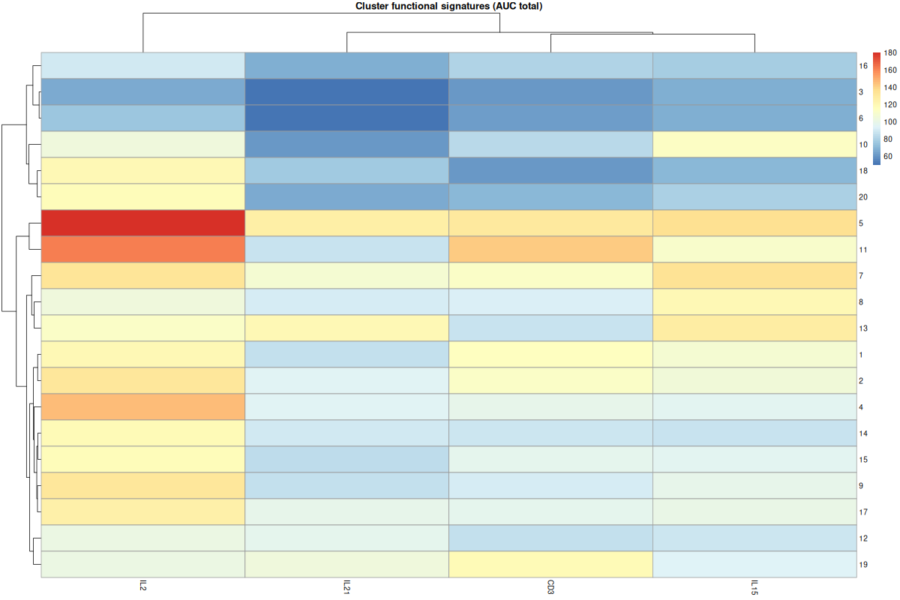{width=0.7\textwidth}

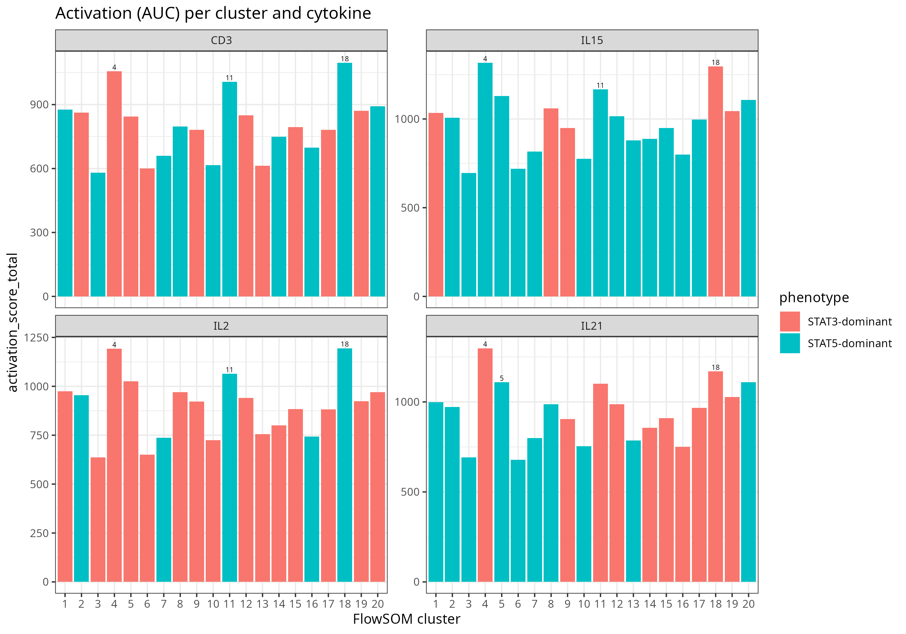{width=0.6\textwidth}

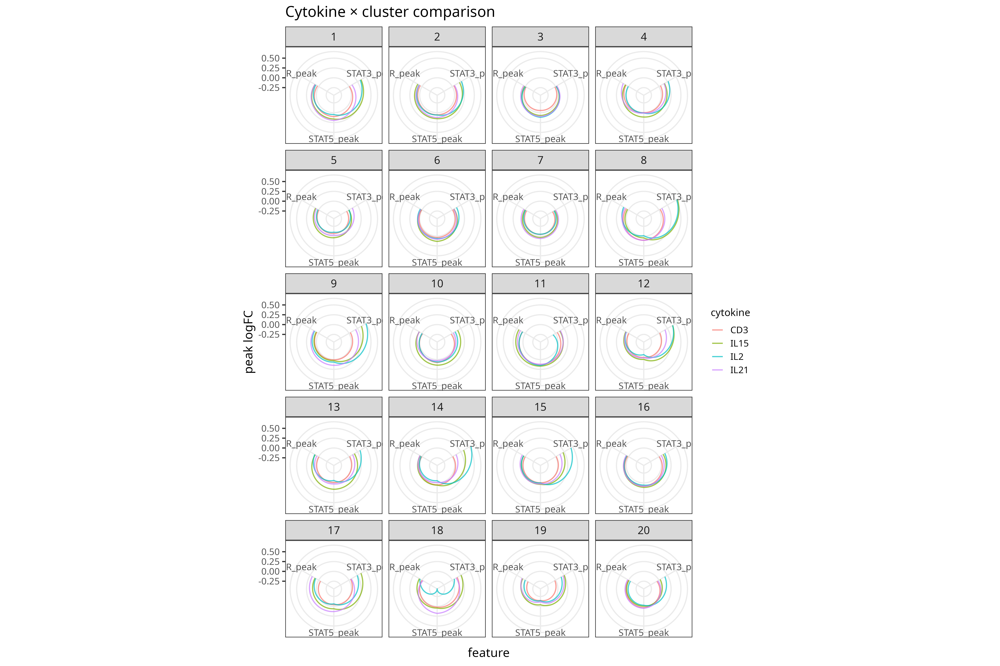{width=0.6\textwidth}

### Automated lineage annotation links signalling programs to CD4/CD8 and differentiation states

To link functional phenotypes to canonical T cell lineages, we developed an automated lineage-annotation pipeline using a curated channel-to-antigen mapping.

The file `lineage_annotation/lineage_mapping.csv` maps each CyTOF channel (`channel_name`) to:

- `antigen` (e.g. CD4, CD8, CD45RA, CCR7, pSTAT3, pSTAT5).
- `group`, indicating membership in higher-level categories such as:
  - Lineage: `CD4_lineage`, `CD8_lineage`.
  - Differentiation: `Naive_markers`, `Memory_markers`, `Activation_markers`.
  - Additional patterns: `Tfh_like`, `TCR_proximal`, `STAT3`, `STAT5`, `Metabolic`, `Stress`.

Any channels present in `lineage_mapping.csv` but not found in `flowsom_results/metacluster_medians_asinh.csv` were automatically ignored with a warning, ensuring that missing markers did not cause failures or spurious NA propagation.

For each marker, medians were z-scaled across clusters to emphasise relative expression patterns. For each cluster and group (CD4_lineage, CD8_lineage, Naive_markers, Memory_markers, Activation_markers, Tfh_like, etc.), a group score was computed as the mean z-score of all markers assigned to that group.

Cluster-level annotations were then derived as follows:

- **Main lineage:** Clusters were assigned to `CD4_T` or `CD8_T` based on which of the CD4_lineage vs CD8_lineage scores was higher, with a lineage confidence metric defined as the difference in scores.
- **Differentiation state:** Naive-like, intermediate, or memory/effector-like states were assigned based on Naive_markers versus Memory_markers and Activation_markers scores:
  - High naive, low memory/activation → `naive_like`.
  - High memory/activation, low naive → `memory_effector_like`.
  - Intermediate profiles → `intermediate`.
- **Combined labels and pathway integration:** For each cluster, a combined label such as `CD4_T_naive_like` or `CD8_T_memory_effector_like` was constructed (`auto_label`). Pathway phenotypes from `functional_cluster_annotations.csv` were joined, yielding composite descriptors (e.g. `CD4_T_memory_effector_like_STAT3_high`).

Applying this scheme to the present dataset stratified the 20 clusters into 8 CD4-lineage and 12 CD8-lineage clusters. Differentiation scoring further resolved the CD4 compartment into 4 intermediate and 4 memory/effector-like clusters, and the CD8 compartment into 2 naive-like, 5 intermediate and 5 memory/effector-like clusters. NA values were restricted to annotation groups not represented in the panel (for example NK-like, Treg-like or gamma-delta-like markers) and are intended.

UMAP overlays coloured by automated lineage (`lineage_annotation/UMAP_by_auto_lineage.png`) and by combined lineage and phenotype (`lineage_annotation/UMAP_by_lineage_and_phenotype.png`) show clear spatial segregation of CD4 versus CD8 clusters and a logical arrangement of naive-, intermediate-, and memory/effector-like states.

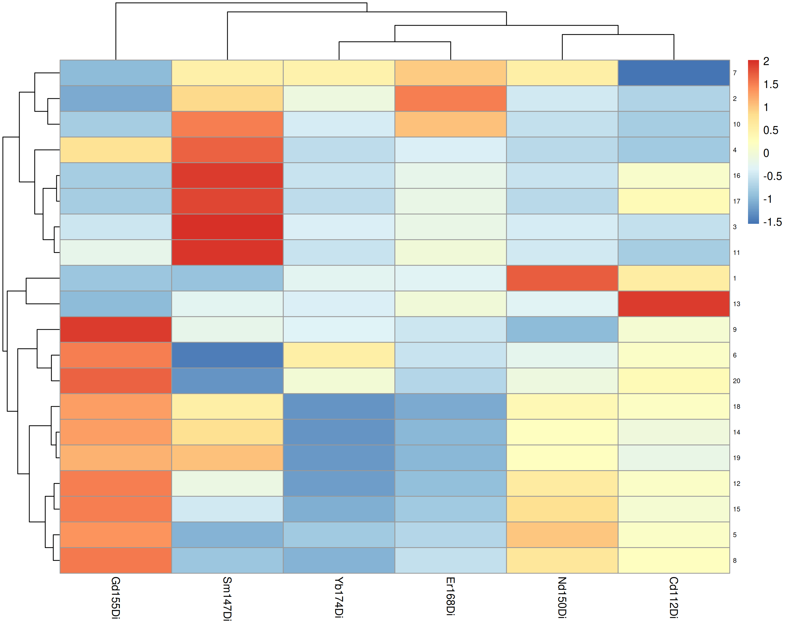{width=0.7\textwidth}

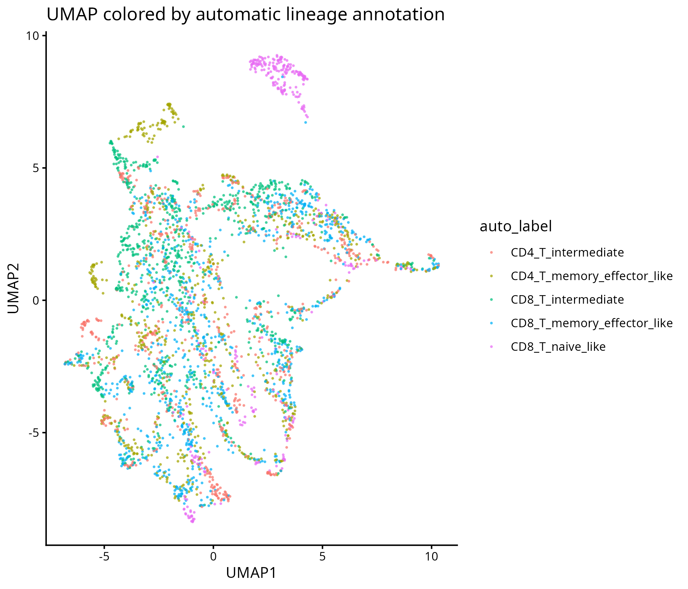{width=0.48\textwidth}
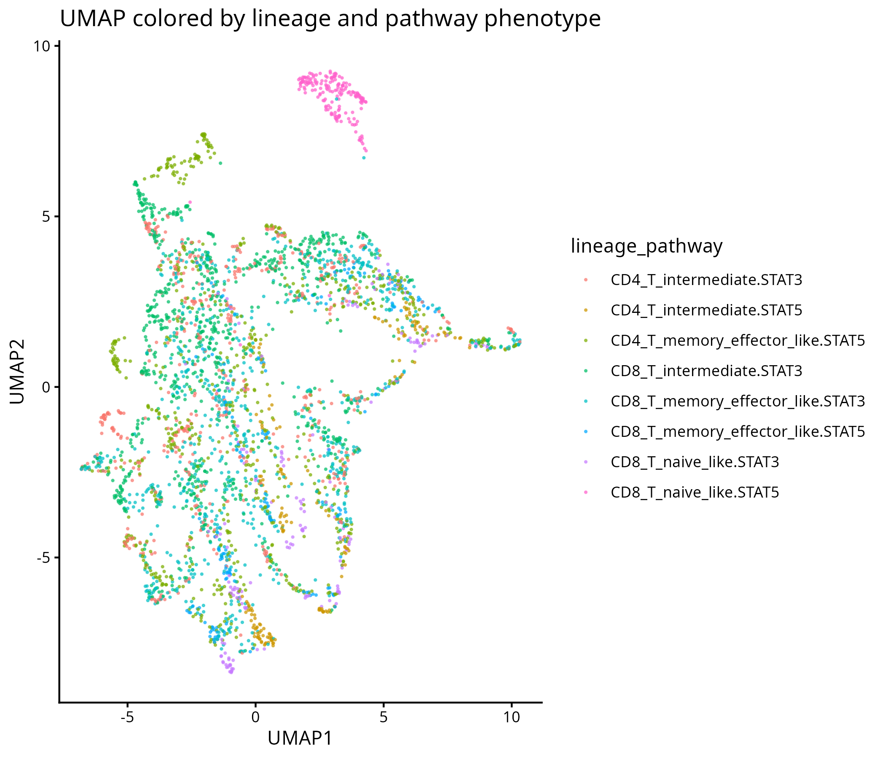{width=0.48\textwidth}

### IL-21-biased STAT3/STAT5 “super-responders” reside in discrete CD4 and CD8 subsets

To quantify cytokine bias for each pathway, we combined pathway activation AUCs with cytokine information and, for each cluster and pathway (STAT3, STAT5, TCR), determined the cytokine with maximal integrated activation. Clusters with IL-21 as best cytokine for STAT3 or STAT5 were designated IL-21-biased.

Across all 20 clusters, STAT3 bias was split between IL-2 and IL-15 (9 clusters each) with only 2 clusters showing IL-21 as the strongest STAT3-activating cytokine. By contrast, STAT5 bias was more evenly distributed across IL-2 (7 clusters), IL-21 (7 clusters), IL-15 (5 clusters) and, in one case, CD3 alone, indicating that IL-2 and IL-15 provide broad STAT3/STAT5 activation across the T cell compartment whereas IL-21 exerts a more selective effect on a restricted subset of clusters. Integration with lineage and differentiation annotations exposed lineage-resolved IL-21 biases:

- **CD4 lineage:** Cluster 11, annotated as `CD4_T_memory_effector_like`, emerged as a prime IL-21-biased STAT3 “super-responder” with concurrent strong STAT5 activation. Additional CD4 clusters (e.g. 1, 3, 7) showed IL-21-biased STAT5 activation with more modest STAT3 engagement.
- **CD8 lineage:** Clusters 8, 9, 14, and 18, annotated as CD8 effector-like, exhibited IL-21-biased STAT5 activation. Cluster 18 showed dual strong STAT3 and STAT5 responses under IL-21, analogous to cluster 11 in the CD4 compartment.

Timecourse trajectories of key STAT3 and STAT5 phospho markers in these clusters (`summary_figures/key_trajectories_STAT3_STAT5.png`, `trajectory_*`) showed that IL-21 drives delayed but sustained STAT3 activation in CD4 memory-like states and more heterogeneous STAT5 kinetics in CD8 effector-like states. Diffusion-like embeddings per cytokine (`diffusion_map_CD3.png`, `diffusion_map_IL2.png`, `diffusion_map_IL15.png`, `diffusion_map_IL21.png`) highlighted distinct topology of signalling trajectories, with IL-21 trajectories traversing regions enriched for dual-STAT super-responders (Figure 6).

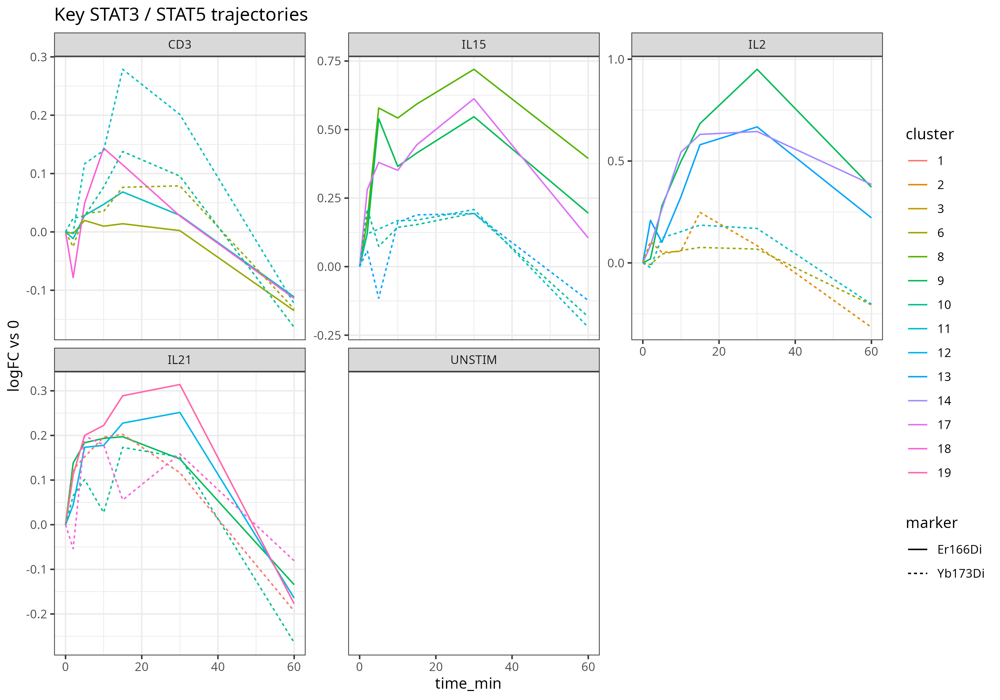{width=0.7\textwidth}

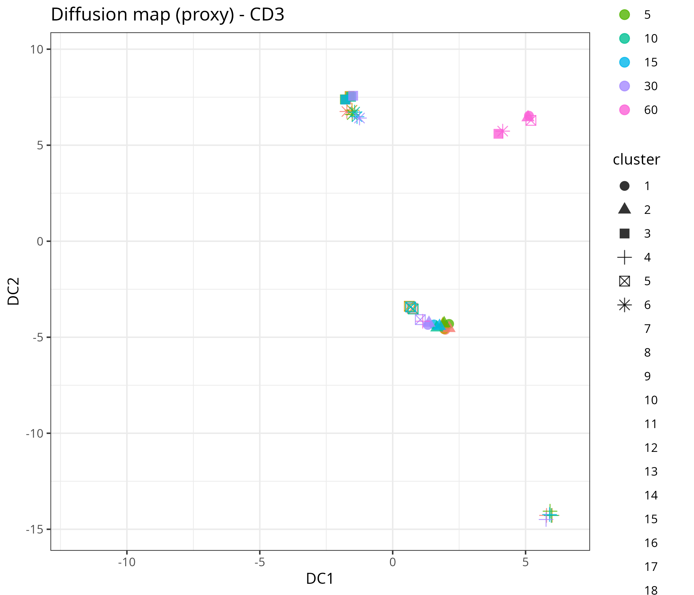{width=0.32\textwidth}
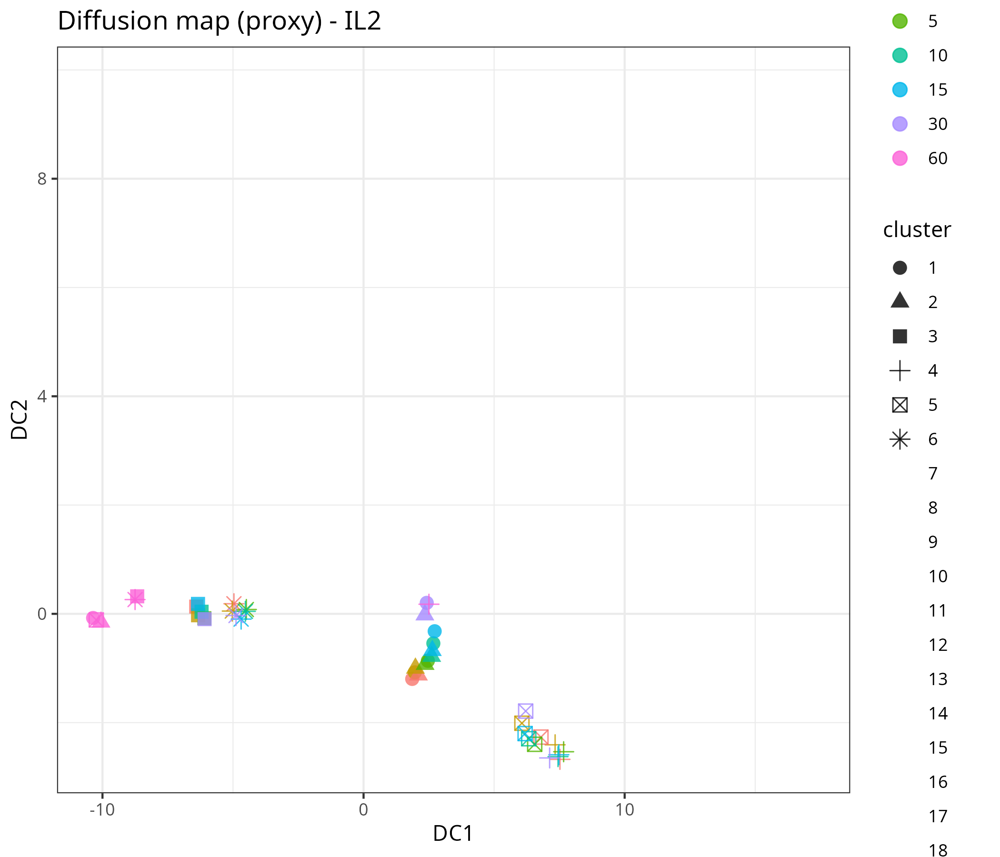{width=0.32\textwidth}
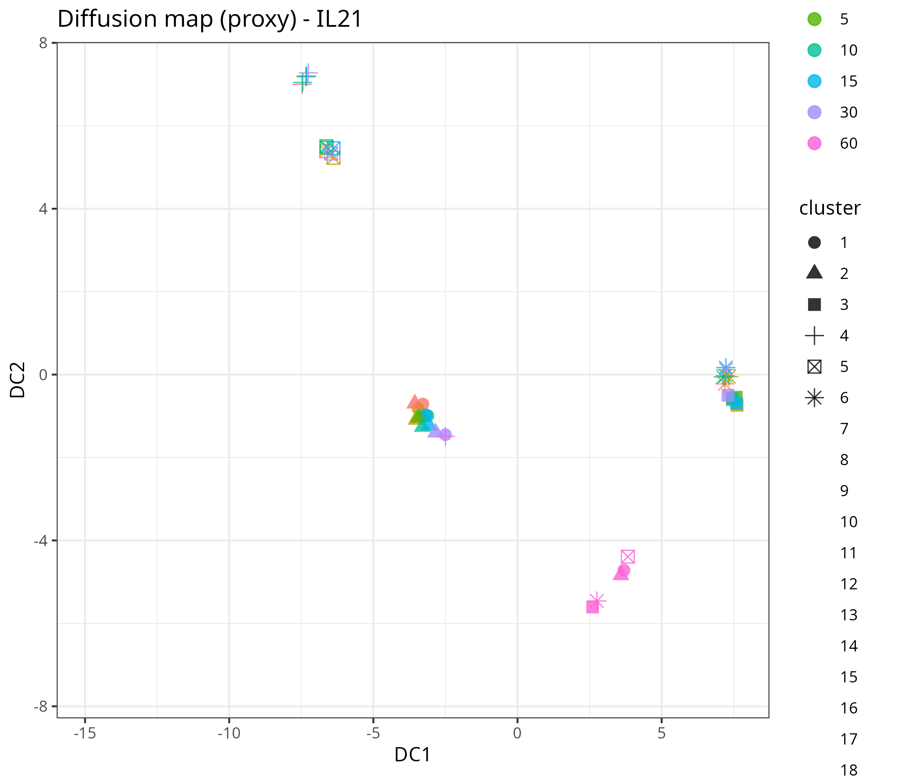{width=0.32\textwidth}

Together, these analyses indicate that IL-21 does not merely reproduce IL-2/IL-15-type STAT5 responses but establishes lineage- and state-specific STAT3 and STAT5 programmes concentrated in discrete subsets of CD4 and CD8 T cells.

---

## Discussion

By integrating high-dimensional CyTOF data with a modular computational pipeline, we reveal that IL-21 programs a distinct signalling architecture in human T cells that cannot be reduced to a minor variant of IL-2 or IL-15. At a global level, cytokine responses are organised along STAT3 and STAT5 axes, with TCR-proximal and metabolic/stress pathways contributing additional structure. Within this space, IL-2 and IL-15 preferentially drive rapid, strong STAT5 activation in CD8 effector-like clusters, whereas IL-21 induces sustained STAT3 activation in CD4 memory-like clusters.

Automated lineage annotation anchored in a curated channel-to-antigen mapping allows objective assignment of FlowSOM clusters to CD4/CD8 lineages and naive/intermediate/memory-effector states. When combined with functional pathway annotations and cytokine bias metrics, this reveals discrete dual-STAT “super-responder” clusters in both CD4 (e.g. cluster 11) and CD8 (e.g. cluster 18) compartments that integrate strong TCR and cytokine signals. These subsets likely represent key decision points at which IL-21 can reprogram downstream differentiation and effector functions, such as support of T follicular helper or long-lived memory phenotypes in the CD4 compartment and modulation of cytotoxic potential in the CD8 compartment.

Our approach is methodologically general. The same pipeline can be applied to other cytokine combinations, co-stimulatory ligands, or checkpoint inhibitors, and extended with subject-level covariates or multi-omics readouts. The automated mapping framework naturally accommodates additional markers or revised groupings, enabling iterative refinement as new biology emerges. Because the pipeline operates at the level of structured CSV outputs and uses standard R packages (FlowSOM, limma, tidyverse, UMAP/t-SNE), it is portable across HPC environments and amenable to reproduction in other labs.

Limitations include the absence of dedicated NK, Treg, or gamma-delta T cell markers in the current panel, which restricts confident annotation of those lineages; imperfect alignment between FlowSOM and PhenoGraph labels in the available `phenograph_labels.csv` and `dimred_metadata.rds`, which constrained formal cluster stability metrics; and the lack of direct functional readouts (e.g. cytokine secretion, proliferation, in vitro killing) to link signalling phenotypes to effector functions. In addition, our modelling assumed that sample-level variation could be adequately captured at the cluster-median level without explicit mixed-effects terms; future studies incorporating per-donor identifiers and subject-level replication could refine these estimates.

Despite these limitations, the combination of temporal, lineage-resolved, and pathway-specific signalling information provides a rich foundation for mechanistic hypotheses about IL-21’s role in shaping T cell responses. The dual-STAT “super-responder” populations identified here represent attractive targets for mechanistic follow-up and potential therapeutic modulation.

---

## Materials and Methods

### Sample preparation and CyTOF acquisition

Human peripheral blood mononuclear cells (PBMCs) were obtained from [insert donor information and ethical approval] and stimulated under a peptide–MHC-dependent TCR engagement condition (pTCR–cHCV) in the presence or absence of gamma-chain cytokines. Cells were exposed to CD3 alone (baseline condition) or CD3 plus IL-2, IL-15, or IL-21 at defined concentrations, and sampled at 0, 2, 5, 10, 15, 30, and 60 minutes. Detailed experimental conditions (donor numbers, cytokine doses, incubation volumes and temperatures, and exact peptide sequences) should be specified according to the originating experimental protocol.

Cells were stained with a metal-tagged antibody panel covering T cell lineage markers (e.g. CD3, CD4, CD8, CD45RA, CCR7), activation and costimulatory markers, and a set of phospho-epitopes capturing STAT3, STAT5, TCR-proximal kinases, metabolic regulators, and stress markers. Staining, fixation, permeabilisation and CyTOF acquisition were performed according to standard protocols in the lab, using [insert instrument model and acquisition settings]. Initial bead-based normalisation and debarcoding, as well as dead cell exclusion and doublet removal, followed established procedures and were performed prior to the analyses reported here.

### Metadata and experimental design

Sample-level metadata were assembled in a design table recording sample identifiers, cytokine condition (CD3, IL-2, IL-15, IL-21), timepoint (0, 2, 5, 10, 15, 30, 60 minutes), batch, anchor status, and other experimental descriptors. A harmonised “cytokine” variable derived from detailed condition labels was used for downstream modelling.

The metadata were checked for missing or inconsistent entries, correct coverage of cytokine × timepoint combinations, and appropriate annotation of anchor samples. Sample counts per condition were summarised to ensure adequate event numbers for cluster-level modelling, and coverage heatmaps were generated for visual inspection.

### Normalisation and channel-level QC

To reduce batch-specific technical variation while preserving biological differences, we used CytoNorm-based normalisation. Anchor samples spanning relevant conditions and batches were selected and used to model marker intensity distributions for each batch. CytoNorm then learned batch-specific transformations that align these distributions across batches, using unstimulated or otherwise comparable reference conditions as the training set.

The learned normalisation function was applied to all CyTOF files to yield normalised expression values. Normalised events were consolidated across samples and per-sample and per-marker medians were computed for QC. Expression values were arcsinh-transformed with a standard CyTOF cofactor and this transformation was applied consistently throughout the workflow.

Channel-level QC included comparison of marker distributions across batches before and after normalisation, both globally and within CD4/CD8 lineage gates. Density plots, boxplots and summary statistics were used to confirm that major batch-specific shifts were removed without compressing biological variation.

### FlowSOM clustering and metacluster medians

We used FlowSOM to identify phenotypically coherent T cell states from arcsinh-transformed expression of a selected set of lineage and functional markers. A self-organising map (SOM) was trained on single-cell data using default FlowSOM parameters and a predefined grid size. SOM codes were subsequently metaclustered using hierarchical or consensus clustering to yield a fixed number of metaclusters.

For each metacluster, median expression of all markers was calculated to obtain a cluster-by-marker summary matrix. Cluster structure was assessed using a FlowSOM minimal spanning tree, global and lineage-focused heatmaps of marker medians, and low-dimensional embeddings coloured by metacluster labels. These diagnostics confirmed that major clusters corresponded to biologically plausible CD4 and CD8 lineages and to naive versus memory/effector phenotypes.
- A lineage-focused heatmap highlighting CD3, CD4, CD8, CD45RA, CCR7, and other lineage markers (`metacluster_lineage_heatmap.png`).

These plots confirmed that major clusters corresponded to biologically plausible CD4 and CD8 lineages and naive versus memory/effector phenotypes.

### Dimensionality reduction for signalling architecture

To explore global signalling patterns, we computed low-dimensional embeddings of cluster-level phospho profiles.

Cluster- and sample-level phospho marker medians were computed from the normalised data, using tables such as `phospho_medians/phos_medians_by_sample_cluster.csv` and `diff_phos_results/phos_medians_by_sample_cluster.csv`. For each cluster, cytokine, and timepoint, we summarised phospho markers that represent key signalling pathways.

Principal component analysis (PCA), t-SNE and UMAP were computed on arcsinh- or z-scaled phospho medians, using scripts in `scripts/R/diagnostic_signaling_qc.R` and related utilities. Outputs included:

- `PCA_phospho.pdf/png` – PCA of cluster-level phospho medians, with points coloured by cytokine–timepoint combinations and/or clusters.
- `UMAP_phospho.pdf/png` – UMAP of the same data, coloured by clusters, cytokine–timepoint, or functional phenotype (`summary_figures/UMAP_by_phenotype.png`, `summary_figures/UMAP_by_cytokine_preference.png`).
- `TSNE_phospho.png/pdf` – t-SNE of the same data, with corresponding overlays coloured by functional phenotype and cytokine preference (`summary_figures/TSNE_by_phenotype.png`, `summary_figures/TSNE_by_cytokine_preference.png`).

These embeddings revealed axes dominated by STAT5- and STAT3-related markers, with additional structure from TCR-proximal and metabolic/stress markers, and were used to interpret cytokine-specific signalling programmes.

### Differential signalling analysis with limma

We used limma to quantify temporal and cytokine-dependent changes in phospho signalling at the cluster level.

The table `diff_phos_results/phos_medians_by_sample_cluster.csv` contains, for each FlowSOM cluster, sample, and marker, the median arcsinh-transformed expression, together with cytokine, timepoint, batch and sample identifiers. Analyses proceeded as follows:

- For each cytokine, we fit linear models for each cluster–marker pair, with timepoint modelled as a factor and baseline at 0 minutes.
- Contrasts were defined for each post-stimulation timepoint versus baseline (2, 5, 10, 15, 30, 60 vs 0 minutes).
- Additional contrasts compared cytokines (e.g. IL-2 vs CD3, IL-15 vs CD3, IL-21 vs CD3) at selected timepoints where relevant.
- Limma’s empirical Bayes variance moderation improved stability of variance estimates across markers and clusters.
- P-values were corrected for multiple testing using the Benjamini–Hochberg procedure.

### Functional module scoring and cytokine bias

### Functional module scoring and cytokine bias

To move beyond marker-wise analyses, we grouped phospho markers into functional modules representing STAT3, STAT5, TCR-proximal, metabolic and stress signalling. For each cluster and cytokine, marker-level log-fold changes over time were z-scored within each marker, and module scores were computed as mean (or weighted mean) z-scores across markers in a module, integrated across time using activation AUC. Each cluster was assigned a dominant pathway phenotype based on the module with the highest activation score across conditions.

To quantify cytokine bias, we determined, for each cluster and pathway (STAT3, STAT5, TCR), which cytokine yielded the maximal activation AUC. Clusters with IL-21 as best cytokine for STAT3 or STAT5 were designated IL-21-biased and examined in detail as potential dual-STAT “super-responder” populations.

### Automated lineage and differentiation annotation

Automated lineage annotation leveraged a curated mapping from mass channels to antigens and to higher-level marker groups (CD4 and CD8 lineage markers, naive-associated and memory/activation-associated markers, T follicular helper-like markers and functional modules such as STAT3, STAT5, TCR-proximal, metabolic and stress). For each FlowSOM cluster, median marker expression was z-scaled across clusters, and group scores were computed as the mean z-score over markers in each group.

Main lineage (CD4_T or CD8_T) was assigned by comparing CD4 versus CD8 group scores, and differentiation state was determined from naive versus memory/activation scores, classifying clusters as naive-like, intermediate or memory/effector-like. Composite labels combined lineage and differentiation state, and pathway phenotypes from module scoring were integrated to yield combined descriptors such as CD4_T_memory_effector_like_STAT3_high. This annotation enabled lineage- and state-resolved visualisation of cytokine and pathway preferences in low-dimensional space.

### Diffusion-like trajectory and timecourse analysis

To visualise dynamic signalling trajectories, we constructed cytokine-specific diffusion-like embeddings using either diffusion maps or UMAP configured with parameters emphasising pseudotemporal structure. For each cytokine, cluster-level or representative single-cell features across timepoints were used as input, and embeddings were coloured by pseudotime, timepoint, lineage or pathway scores. These embeddings highlighted distinct temporal paths under CD3, IL-2, IL-15 and IL-21 stimulation and helped identify regions enriched for IL-21-biased dual-STAT super-responder clusters.

Complementary timecourse plots for selected markers and clusters were generated by plotting median expression or log-fold change over time for each cytokine and lineage, allowing direct comparison of signalling kinetics across conditions.

### Software environment and reproducibility

All computational analyses were performed in R (version to be specified) on a Linux high-performance computing environment. Key packages included FlowSOM for clustering, limma for differential modelling, the tidyverse suite for data manipulation and plotting, uwot or Rtsne for UMAP/t-SNE, and cowplot/patchwork for figure assembly. Diffusion maps or diffusion-like embeddings were generated using destiny or equivalent tools where available. Random seeds were set for clustering and dimensionality reduction steps to enhance reproducibility.

---

## References

1. Bendall SC, Simonds EF, Qiu P, et al. Single-cell mass cytometry of differential immune and drug responses across a human hematopoietic continuum. *Science*. 2011;332(6030):687–696.
2. Finck R, Simonds EF, Jager A, et al. Normalization of mass cytometry data with bead standards. *Cytometry A*. 2013;83(5):483–494.
3. Van Gassen S, Callebaut B, Van Helden MJ, et al. FlowSOM: Using self-organizing maps for visualization and interpretation of cytometry data. *Cytometry A*. 2015;87(7):636–645.
4. Ritchie ME, Phipson B, Wu D, et al. limma powers differential expression analyses for RNA-sequencing and microarray studies. *Nucleic Acids Res*. 2015;43(7):e47.
5. Haghverdi L, Buettner F, Theis FJ. Diffusion pseudotime robustly reconstructs lineage branching. *Nat Methods*. 2016;13(10):845–848.
6. Relevant primary and review articles on IL-2, IL-15, IL-21 and STAT3/STAT5 signalling in T cells (to be completed with journal-preferred reference style).

---

## Figure Legends

**Figure 1. Experimental design, coverage, and normalisation.**  
(A) Heatmap of cytokine–timepoint coverage across samples after QC, with columns representing CD3, IL-2, IL-15 and IL-21 at 0, 2, 5, 10, 15, 30 and 60 minutes and rows individual samples; colour intensity reflects retained event counts. (B) Global normalisation efficiency across markers and batches, showing bead- and anchor-based CytoNorm correction of median intensities for each marker and batch. (C) Lineage-stratified normalisation diagnostics for key markers in CD4 and CD8 T cells, demonstrating aligned distributions across batches. (D) Representative marker intensity distributions across batches highlighting removal of major batch effects while preserving biological variation.

**Figure 2. FlowSOM clustering and basic QC.**  
(A) FlowSOM minimum spanning tree (MST) of metaclusters, with nodes coloured by cluster ID, illustrating the phenotypic relationships between clusters. (B) Heatmap of arcsinh-transformed marker medians per metacluster across all markers. (C) Lineage-focused heatmap highlighting CD3, CD4, CD8, CD45RA, CCR7 and related markers, revealing CD4- and CD8-dominant metaclusters and naive versus memory/effector states. (D) UMAP of single-cell events coloured by FlowSOM cluster, showing compact, well-separated islands. (E) The same UMAP coloured by batch, indicating minimal batch-driven structure. (F) Counts of events per cluster and condition, illustrating balanced sampling across cytokine and timepoint combinations.

**Figure 3. Global phospho-signalling architecture and functional phenotypes.**  
(A) PCA of cluster-level phospho medians aggregated by cytokine and timepoint, with points coloured by cytokine; PC1 and PC2 align with STAT5- and STAT3-dominated axes. (B) UMAP of phospho medians coloured by FlowSOM cluster, showing that clusters occupy distinct regions of signalling space. (C) UMAP of phospho medians coloured by dominant functional module (STAT3, STAT5, TCR-proximal, Metabolic, Stress), revealing pathway-specific territories. (D) Heatmap of functional module activation scores across clusters, highlighting STAT5-high CD8 effector-like clusters, STAT3-high CD4 memory-like clusters and clusters dominated by TCR-proximal or metabolic/stress signatures.

**Figure 4. Time-resolved differential signalling and cytokine bias.**  
(A–C) Heatmaps of limma-derived log-fold changes (logFC) in phospho-marker intensity relative to baseline across timepoints for representative (A) CD3-alone, (B) IL-2 or IL-15, and (C) IL-21 conditions; rows represent markers and columns timepoints. IL-2/IL-15 induce rapid, strong STAT5 phosphorylation, whereas IL-21 elicits delayed but sustained STAT3 activation, particularly in CD4 memory-like states. (D) Barplots of pathway activation AUC per cytokine showing that IL-2 and IL-15 preferentially engage STAT5 pathways whereas IL-21 drives STAT3. (E) Summary plots of cytokine bias across clusters for STAT3, STAT5 and TCR-proximal modules, highlighting clusters with IL-21 as best cytokine for STAT3 or STAT5, including dual-STAT “super-responder” clusters.

**Figure 5. Automated lineage annotation and lineage × phenotype mapping.**  
(A) Heatmap of scaled median expression for key lineage and differentiation markers (CD3, CD4, CD8, CD45RA, CCR7, CD27 and activation markers) across FlowSOM clusters, used to compute group scores and assign automated lineage and differentiation states. (B) UMAP of single-cell events coloured by automated main lineage label (`CD4_T` vs `CD8_T`), revealing largely non-overlapping CD4 and CD8 territories. (C) UMAP coloured by composite lineage × pathway phenotype labels (e.g. CD4_T_memory_effector_like_STAT3_high, CD8_T_effector_STAT5_high), illustrating where distinct functional states reside within each lineage. (D) UMAP coloured by cytokine preference (best cytokine per cluster for STAT3/STAT5/TCR), highlighting IL-21-biased regions within the embedding.

**Figure 6. IL-21-biased clusters and signalling trajectories.**  
(A) Time-resolved trajectories of STAT3 and STAT5 phosphorylation in representative IL-21-biased clusters from CD4 and CD8 lineages (for example clusters 11 and 18), with median expression or logFC plotted over time for each cytokine; IL-21 induces delayed but sustained STAT3 activation in CD4 memory-like clusters and heterogeneous STAT5 dynamics in CD8 effector-like clusters, while IL-2/IL-15 drive rapid, transient STAT5 peaks. (B–D) Diffusion-like embeddings of signalling trajectories under (B) CD3 alone, (C) IL-2 and (D) IL-21, coloured by pseudotime or timepoint. CD3 trajectories are short and largely confined to TCR-proximal space, IL-2 trajectories extend along a STAT5 axis and converge on CD8 effector-like regions, and IL-21 trajectories traverse distinct STAT3-rich regions enriched for dual-STAT super-responder clusters.
